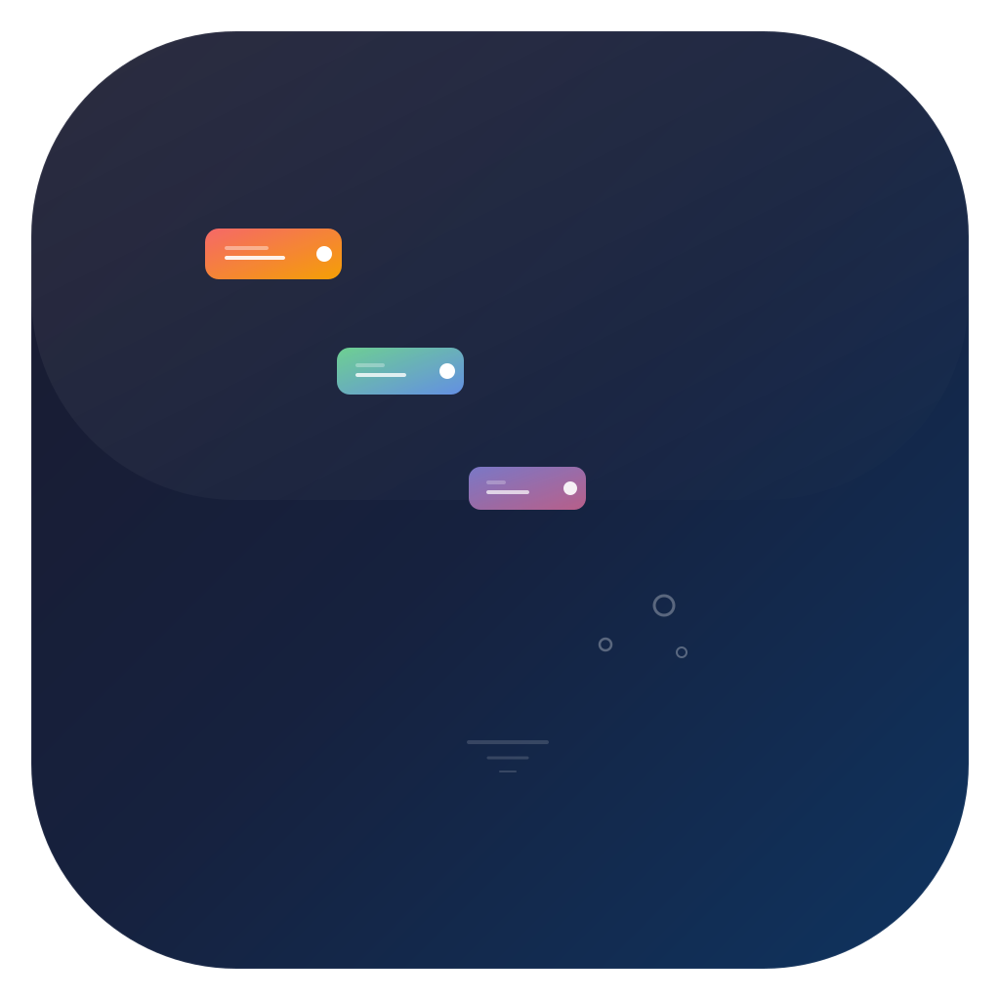

<p align="center">
  
</p>

<h1 align="center">QuickPanel</h1>

<p align="center">
  <strong>macOS 菜单栏快捷操作面板</strong><br />
  <code>⌥⌘P</code> 一键唤出 · 控制中心没有的功能
</p>

<p align="center">
  <a href="README.md">🇨🇳 中文</a> · <a href="README_EN.md">🇬🇧 English</a>
</p>

<p align="center">
  
  
  
  
</p>

<p align="center">
  <a href="#-功能一览">功能</a> ·
  <a href="#-面板预览">预览</a> ·
  <a href="#-安装">安装</a> ·
  <a href="#-双入口模式">双入口</a> ·
  <a href="#-自定义">自定义</a>
</p>

---

**QuickPanel** 是 macOS 轻量工具面板。只做 Apple 控制中心 **没有的实用功能**，支持菜单栏点击和全局快捷键 `⌥⌘P` 两种方式打开。

> 🆓 免费 · 🧩 开源 MIT · ⚡ ~800KB · 🔒 纯本地运行

---

## 🎯 功能一览

| 类别 | 功能 | 说明 |
|------|------|------|
| 🧠 | **DeepSeek 余额** | 面板顶部大号显示 API 余额，颜色随余额变化 |
| 🖼️ | **截图工具** | 区域/窗口/全屏/剪贴板 |
| 🪟 | **窗口布局** | 左半/右半/全屏/居中 |
| ☕ | **阻止休眠** | `caffeinate` 一键保持 Mac 唤醒 |
| 👁️ | **隐藏文件** | Finder 显示/隐藏系统文件 |
| 🔒 | **锁定屏幕** | 一键锁屏 |
| 🗑️ | **清空废纸篓** | 快捷清理 |
| ⌨️ | **输入法切换** | 搜狗拼音 / ABC 一键切换 |
| 🖥️ | **桌面图标** | 隐藏/显示 |
| 📝 | **快速笔记** | 保存到 Obsidian 收件箱 |
| ⏰ | **番茄钟** | 25min 专注 / 5min 休息，通知+响铃 |
| 📋 | **剪贴板历史** | 自动记录 20 条，点击即粘贴 |
| 🧹 | **清空剪贴板** | 一键清空 |
| 🏃 | **一键场景** | 💼工作 / 🌙深夜 / 🎤演示 / 🚪出门 |
| 📦 | **内置更新** | 偏好设置中一键检查更新 |

---

## 📸 面板预览

```
┌──────────────────────────────────────┐
│ 🧠 DeepSeek          已连接     🔄   │  ← Hero 头部
│   41.64  CNY                         │  ← 大号余额数字
│   充值 41.64   赠送 0.00             │
│                          更新: 06/07  │
├──────────────────────────────────────┤
│ 🔍 QuickPanel              ⌥⌘P      │
├──────────────────────────────────────┤
│ Ａ 输入 & 桌面                       │
│   Ａ 输入法 (中/英)               ›  │
│   🖥️ 桌面图标                    ○   │
├──────────────────────────────────────┤
│ ⚡ 快捷操作                          │
│   🔒 锁定屏幕                    ›  │
│   🗑️ 清空废纸篓                 ›   │
│   📝 笔记 → Obsidian             ›  │
│   ⏰ 番茄钟                      ›  │
│   📋 剪贴板历史 (3)  🧹       ▼    │
├──────────────────────────────────────┤
│ 🖼️ 截图                              │
│ [区域] [窗口] [全屏] [剪贴板]        │
├──────────────────────────────────────┤
│ 🪟 窗口布局                          │
│ [◧左半] [◨右半] [⛶全屏] [⬡居中]     │
├──────────────────────────────────────┤
│ 🛠️ 系统工具                          │
│ ☕ 阻止休眠                      ○   │
│ 👁️ 隐藏文件                     ○   │
├──────────────────────────────────────┤
│ 🏃 一键场景                          │
│ [💼工作] [🌙深夜] [🎤演示] [🚪出门]  │
├──────────────────────────────────────┤
│ ⚙️ 偏好设置     ⌥⌘P           退出   │
└──────────────────────────────────────┘
```

---

## 🏗️ 双入口模式

| 方式 | 操作 | 特点 |
|------|------|------|
| ▦ **菜单栏图标** | 点击图标弹出下拉面板 | 随点随关，不占桌面 |
| ⌥⌘P **全局快捷键** | 按 `⌥⌘P` 唤出浮动面板 | 可拖动、位置记忆、适合番茄钟等长时间使用 |

---

## 📦 安装

```bash
# 方式一：下载 Release（推荐）
# https://github.com/YunhaoDou/macos-quick-panel/releases
# 下载 .dmg → 拖到 Applications

# 方式二：源码构建
git clone https://github.com/YunhaoDou/macos-quick-panel.git
cd macos-quick-panel
bash scripts/build.sh
open dist/QuickPanel.app
```

---

## ⚙️ 偏好设置

| 设置项 | 说明 |
|--------|------|
| **DeepSeek API Key** | 输入 Key + 测试按钮，自动从 `~/.hermes/.env` 读取 |
| **Obsidian 路径** | 快速笔记保存目录 |
| **开机启动** | 登录时自动启动 |
| **检查更新** | 自动检测 GitHub Release |

---

## ✅ 开箱即用 vs 控制中心

| 功能 | QuickPanel | 控制中心 |
|------|-----------|---------|
| 截图工具 | ✅ | ❌ |
| 窗口布局 | ✅ | ❌ |
| 阻止休眠 | ✅ | ❌ |
| 隐藏文件 | ✅ | ❌ |
| 锁定屏幕 | ✅ | ❌ |
| 清空废纸篓 | ✅ | ❌ |
| 输入法切换 | ✅ | ❌ |
| 桌面图标 | ✅ | ❌ |
| 快速笔记 | ✅ | ❌ |
| 番茄钟 | ✅ | ❌ |
| 剪贴板历史 | ✅ | ❌ |
| 一键场景 | ✅ | ❌ |
| DeepSeek 余额 | ✅ | ❌ |
| 内置更新 | ✅ | ❌ |
| 深色/音频/勿扰 | ❌ 由控制中心提供 | ✅ |

---

## 🏗️ 架构

```
Sources/QuickPanel/
├── QuickPanelApp.swift       # @main + AppState (状态管理中心)
├── MenuBarContent.swift      # 菜单栏面板 UI + 毛玻璃
├── PanelManager.swift        # 浮动主面板 (NSPanel)
├── Helpers/
│   ├── DeepSeekManager.swift     # API 余额查询 (hero 头部)
│   ├── SystemCommands.swift      # 锁屏、废纸篓
│   ├── ClipboardManager.swift    # 剪贴板监听
│   ├── InputMethodManager.swift  # TIS 输入法
│   ├── DesktopIconsManager.swift # 桌面图标
│   ├── ScreenshotManager.swift   # 截图 + 窗口布局
│   ├── CaffeinateManager.swift   # 阻止休眠
│   ├── FinderHiddenFilesManager.swift
│   ├── HotkeyManager.swift       # 全局快捷键 (Carbon)
│   ├── AppUpdater.swift          # 内置自动更新
│   └── SettingsStore.swift       # UserDefaults 持久化
└── Features/
    ├── PomodoroView.swift        # 番茄钟 UI
    ├── QuickNote.swift           # 快速笔记编辑器
    ├── ObsidianManager.swift     # Obsidian 写入
    ├── Macros.swift              # 一键场景
    ├── ClipboardHistoryView.swift
    └── PreferencesView.swift     # 偏好设置
```

### 技术栈

| 层 | 技术 |
|----|------|
| **语言** | Swift 5.9+ |
| **UI** | SwiftUI MenuBarExtra + NSPanel + NSVisualEffectView |
| **API** | DeepSeek `/user/balance` 余额查询 |
| **截图** | `screencapture` CLI |
| **窗口管理** | AppleScript |
| **快捷键** | Carbon Event HotKey (⌥⌘P) |
| **最低** | macOS 13.0 (Ventura) |
| **构建** | Swift Package Manager + ad-hoc 签名 |

---

## 🗺️ 路线图

- [x] DeepSeek 余额头部 (置顶 + 大号数字 + 颜色编码)
- [x] 快捷操作（锁屏/废纸篓/笔记/番茄钟/剪贴板）
- [x] 输入法 + 桌面图标
- [x] 截图 + 窗口布局
- [x] Caffeinate + 隐藏文件
- [x] 一键场景 (4种)
- [x] 毛玻璃 + Toast
- [x] 全局快捷键 ⌥⌘P
- [x] 双入口 (菜单栏 + 浮动面板)
- [x] 偏好设置 + 内置更新
- [ ] 自定义场景编辑
- [ ] Homebrew Cask
- [ ] GitHub Actions CI

---

## 📄 许可证

[MIT License](LICENSE) © 2025 YunhaoDou

<p align="center">
  <a href="README_EN.md">🇬🇧 English</a>
</p>
